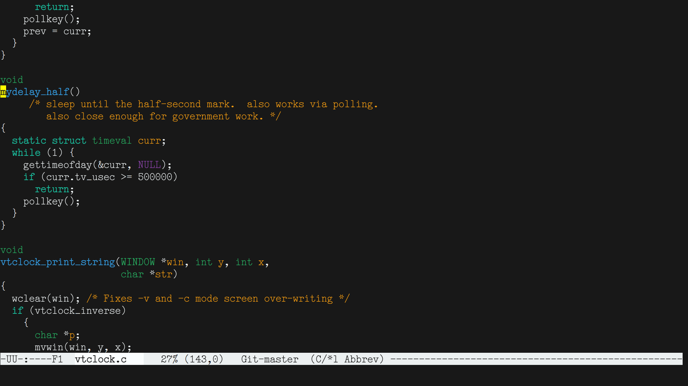

# DSE Typewriter

A project to create a coding font inspired by pre-war typewriters.

And to practice editing fonts directly in FontForge.

## Characteristics

-   Low ex-height.
-   Full ASCII and Latin-1 coverage, and then some.
-   Coding-friendly distinctive characters: `li1|` `Oo0` `` `'" ``
-   It's elite!  As in, not pica.

## Unicode Coverage

-   All printable ASCII (U+0020 through U+007E) and ISO Latin-1 (U+00A0 through U+00FF),
    and selected extended Latin characters (more to come, I suppose).
-   Selected punctuation, graphic, and currency symbols.

## Answers to Questions You Might Ask

-   There aren't any hints.  Chances are, at any particular point in
    time, my brain is too mush to learn how to do those.

## License

[SIL OFL 1.1](LICENSE.md)

## Preview

