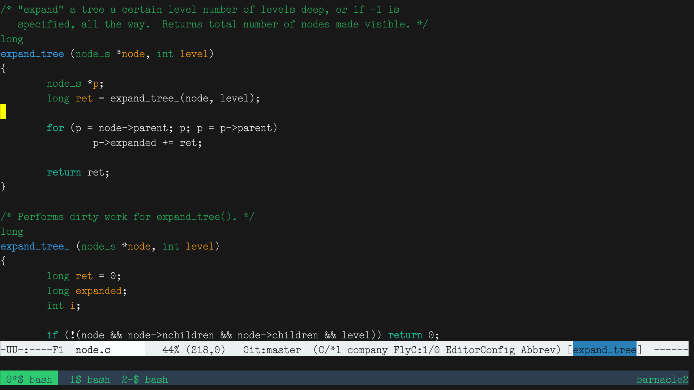

# DSE Typewriter

A project to create a coding font inspired by pre-war typewriters.

And to practice editing fonts directly in FontForge.

## Characteristics

-   Low ex-height
-   Full ASCII and Latin-1 coverage, and then some
-   Coding-friendly distinctive characters: `li1|` `Oo0` `` `'" ``
-   It's elite!  As in, not pica.

## Preview

